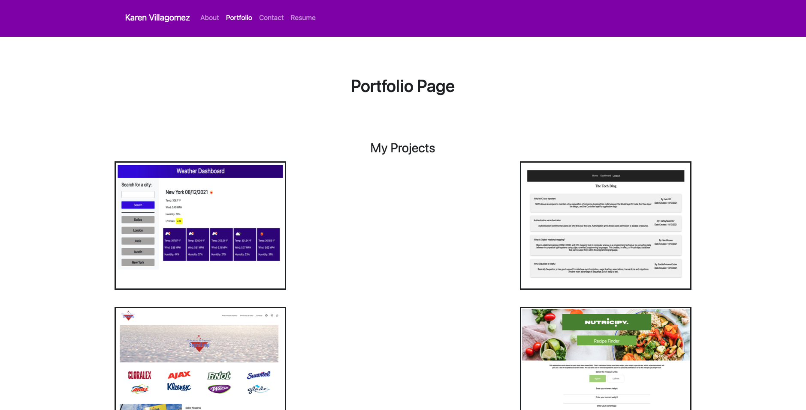
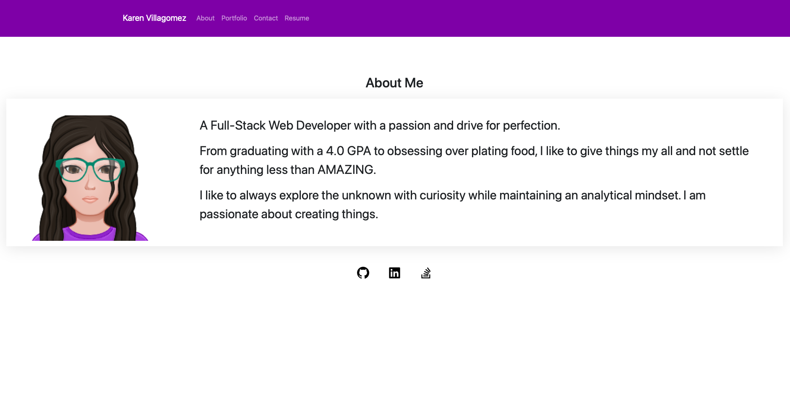
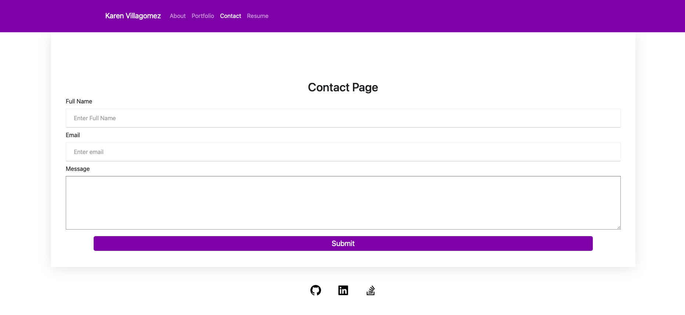
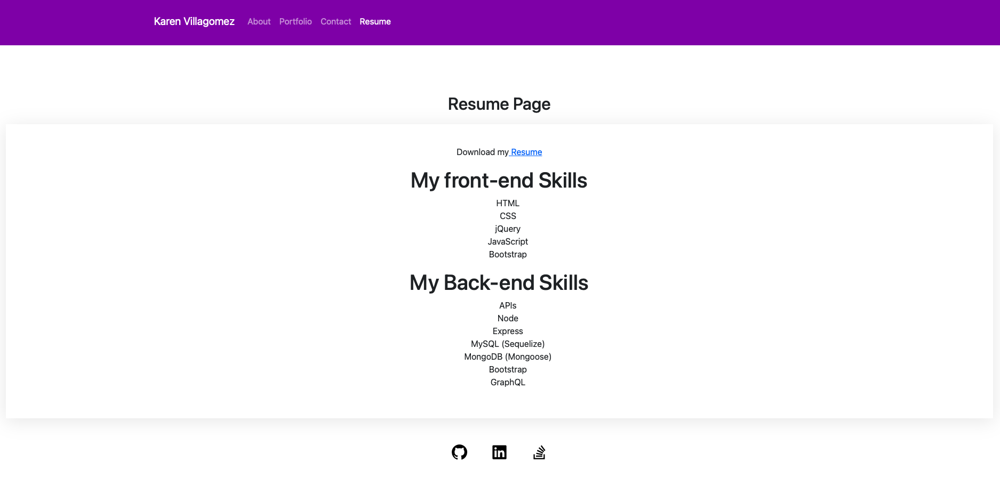

## Portfolio

This is a website portfolio created for as a project to improve my (at the time) beginner React knowledge.

## Table of Contents

- [Features](#features)
- [Website Pictures](#pictures)
- [Tecnologies](#tecnologies)
- [Contact Info](#contact-info)
- [License](#license)
- [Llinks](#links)
  
 

---
## Features

When you hover over a project picture you will have access to the:
1. Project Name.
2. Github repository link.
3. Website link.

---

## Pictures

### My Work and past projects.

### About me section.

---

### Contact me section.

---

### Resume Section

---
## Tecnologies

1. Bootstrap
2. React
3. CSS
4. Apollo-server-express
5. mongoose
6. graphQL
7. apollo/client

## Contact Info 

KarenHarley88@gmail.com

## License

The license used for this project: MIT

#### Links:

Github:
https://github.com/KarenHarley/React-Portfolio

Website:
https://karenharley.github.io/React-Portfolio

